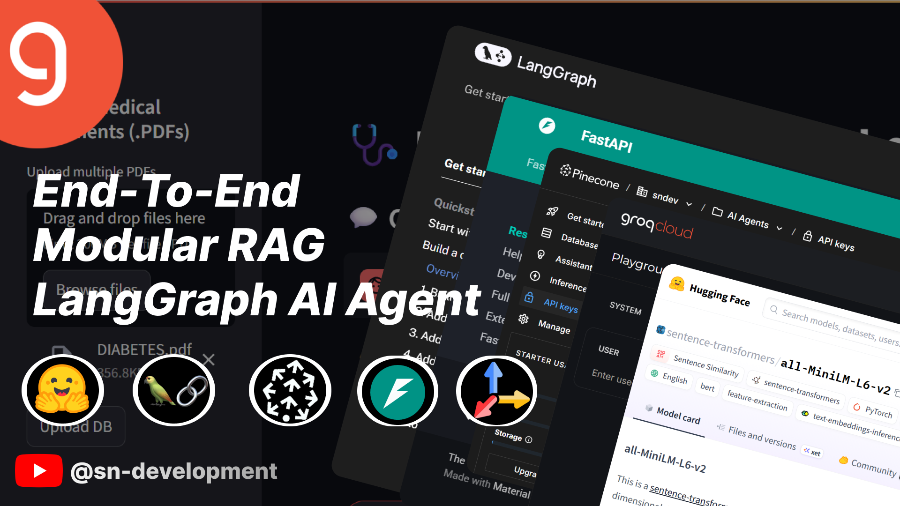

# 🤖 Smart AI Agent: RAG, Web Search & LangGraph



🔗 **[Download Project PDF](assets/agentBot.pdf)**

---

This repository contains the code for a sophisticated AI Agent application capable of answering user queries by intelligently leveraging both a private, custom knowledge base (using Retrieval-Augmented Generation - RAG) and real-time web search. Users have granular control over the web search feature, enhancing flexibility and transparency.

---

## ✨ Key Features

- **Hybrid AI & Intelligent Routing**: Combines internal RAG knowledge with real-time web search, dynamically selecting the best information source for each query.

- **User-Controlled Web Access**: Provides a UI toggle to enable or disable web search, allowing users to choose between internal-only knowledge or broader internet access.

- **Transparent AI Workflow (Agent Trace)**: Offers a detailed, step-by-step trace of the agent's internal thought process, including routing decisions, RAG sufficiency verdicts, and information retrieval summaries.

- **Contextual RAG Sufficiency Judgment**: Employs an LLM to critically assess if retrieved RAG content is sufficient to answer a query, preventing incomplete responses and prompting further search if needed.

- **Dynamic Knowledge Ingestion (PDF Upload)**: Users can upload PDF documents directly, which are automatically processed, embedded, and added to the agent's Pinecone knowledge base.

- **Modular & Extensible Design**: Clean, layered architecture (FastAPI, LangGraph, Streamlit) makes it easy to understand, debug, and expand.

- **Persistent Conversation Memory**: LangGraph's checkpointing maintains conversation context across multiple turns.

---

## 🚀 High-Level Architecture

### 🧩 Layers Overview:

- **User Interface (UI)**: Streamlit app for interaction.
- **API Layer**: FastAPI backend that receives and handles requests.
- **Agent Core**: LangGraph-powered AI logic with routing and tools.
- **Knowledge Base**: Pinecone vector DB + HuggingFace embeddings.
- **External Tools**: Groq LLM, Tavily Search API.

---

## 📦 Core Modules Structure

```
agentBot/
├── frontend/
│   ├── app.py                  # Streamlit entry point
│   ├── ui_components.py       # Chat UI, toggle, trace
│   ├── backend_api.py         # API communication
│   ├── session_manager.py     # Streamlit state management
│   └── config.py              # Frontend config
│
├── backend/
│   ├── main.py                # FastAPI entry point
│   ├── agent.py               # LangGraph AI agent workflow
│   ├── vectorstore.py         # Pinecone RAG logic
│   └── config.py              # API keys and env vars
│
│
├── requirements.txt          # Python dependencies
└── .env                      # API keys (not committed)
```

---

## ⚙️ Technology Stack

- **Language**: Python 3.9+
- **Frontend**: Streamlit
- **Backend**: FastAPI
- **Agent Orchestration**: LangGraph
- **LLMs & Tools**: LangChain, Groq (Llama 3)
- **Embeddings**: sentence-transformers/all-MiniLM-L6-v2
- **Vector Store**: Pinecone
- **PDF Processing**: PyPDFLoader
- **Search Engine**: Tavily API

---

## 🛠️ Setup and Installation

### Prerequisites

- Python 3.9+
- API Keys:

  - `GROQ_API_KEY`
  - `PINECONE_API_KEY`
  - `TAVILY_API_KEY`

- Pinecone index: `rag-index` with 384 dimensions and cosine metric

### Installation

```bash
git clone https://github.com/your-username/agentBot.git
cd rag_agent_app
uv venv
source .venv/bin/activate  # On Windows: .venv\Scripts\activate
uv pip install -r requirements.txt
```

Create a `.env` file at project root:

```dotenv
GROQ_API_KEY="your_groq_api_key_here"
PINECONE_API_KEY="your_pinecone_api_key_here"
PINECONE_ENVIRONMENT="your_pinecone_environment"
TAVILY_API_KEY="your_tavily_api_key"
FASTAPI_BASE_URL="http://localhost:8000"
```

---

## 🏃 Running the Application

### 1. Start the Backend (FastAPI)

```bash
cd backend
uvicorn main:app --reload --host 0.0.0.0 --port 8000
```

### 2. Start the Frontend (Streamlit)

```bash
cd ..
streamlit run frontend/app.py
```

---

## 🧪 API Testing with Postman

### `/upload-document/` (POST)

- **URL**: `http://localhost:8000/upload-document/`
- **Body**: `form-data`, key=`file`, type=`File`
- **Response**:

```json
{
  "message": "PDF 'doc.pdf' successfully uploaded and indexed.",
  "filename": "doc.pdf",
  "processed_chunks": 5
}
```

### `/chat/` (POST)

- **URL**: `http://localhost:8000/chat/`
- **Body** (JSON):

```json
{
  "session_id": "test-session-001",
  "query": "What are the treatment of diabetes?",
  "enable_web_search": true
}
```

- **Response**:

```json
{
  "response": "Your agent's answer here...",
  "trace_events": [
    {
      "step": 1,
      "node_name": "router",
      "description": "...",
      "event_type": "router_decision"
    }
  ]
}
```

---

## 🚀 Future Improvements

- Integrate tools: calculator, calendar, code interpreter
- Stream LLM output token-by-token
- Advanced RAG techniques: reranking, multi-query
- Long-term memory database for chat history
- User authentication & profiles
- Enhanced UI: dark mode, animations, custom themes

---

## 📬 Feedback & Contributions

Feel free to open issues or PRs for suggestions, bugs, or enhancements.

> Built with ❤️ using LangGraph, LangChain, Groq, and Streamlit
