# 🤖 Smart AI Agent — RAG + Web Search powered by LangGraph

An intelligent AI agent that answers questions by combining **Retrieval-Augmented Generation (RAG)** with **real-time web search**. Built with a modular architecture using FastAPI, Streamlit, and LangGraph — giving users full control and transparency over how answers are generated.

```mermaid
graph TD
    User["👤 User"] --> Frontend

    subgraph Frontend ["Streamlit Frontend"]
        A["Chat UI"]
        B["PDF Upload"]
        C["Web Search Toggle"]
        D["Agent Trace Viewer"]
    end

    Frontend -->|"HTTP POST /chat/"| Backend
    Frontend -->|"HTTP POST /upload-document/"| Backend

    subgraph Backend ["FastAPI Backend"]
        E["REST API Endpoints"]
        F["Request Handling"]
    end

    Backend --> Agent

    subgraph Agent ["LangGraph Agent Core"]
        Router["Router Node"] -->|"route = rag"| RAG["RAG Lookup Node"]
        Router -->|"route = web"| Web["Web Search Node"]
        Router -->|"route = answer"| Answer["Answer Node"]
        RAG -->|"sufficient"| Answer
        RAG -->|"not sufficient"| Web
        Web --> Answer
    end

    RAG --> Pinecone["🟦 Pinecone - Vector DB"]
    RAG --> HF["🟡 HuggingFace - Embeddings"]
    Web --> Tavily["🟢 Tavily - Web Search API"]
    Answer --> Groq["🟣 Groq - Llama 3 70B"]
    Router --> Groq
```



---

## ✨ Features

- **Intelligent Query Routing** — Automatically decides whether to search internal documents, the web, or answer directly
- **RAG with Pinecone** — Upload PDFs and query them instantly using vector similarity search
- **Live Web Search** — Falls back to Tavily web search when internal knowledge is insufficient
- **Sufficiency Judgment** — An LLM judge evaluates if RAG results actually answer the question before responding
- **User-Controlled Web Toggle** — Enable or disable web search from the UI at any time
- **Agent Trace Viewer** — See exactly how the agent routed your query, what it retrieved, and why
- **Conversation Memory** — LangGraph checkpointing maintains context across multiple turns
- **PDF Upload** — Drag-and-drop PDF ingestion into the knowledge base

---

## 🏗️ Architecture

The application is split into three layers:

| Layer | Technology | Role |
|-------|-----------|------|
| **Frontend** | Streamlit | Chat UI, file upload, settings, trace viewer |
| **Backend** | FastAPI | REST API, request handling, document processing |
| **Agent Core** | LangGraph | Query routing, RAG retrieval, web search, answer generation |

### Agent Workflow

```
User Query → Router → RAG Lookup → Sufficiency Check → Answer
                 ↓                        ↓ (insufficient)
            Web Search ←─────────────────┘
                 ↓
              Answer
```

The **Router** analyzes each query and picks the best path. If RAG retrieval is insufficient, a **Judge LLM** detects this and reroutes to web search automatically.

---

## 🧩 Project Structure

```
Smart-AI-Agent/
├── backend/
│   ├── config.py              # Environment variables and API keys
│   ├── vectorstore.py         # Pinecone vector store + HuggingFace embeddings
│   ├── agent.py               # LangGraph agent with 4-node state machine
│   └── main.py                # FastAPI server with chat and upload endpoints
│
├── frontend/
│   ├── config.py              # Frontend configuration
│   ├── session_manager.py     # Streamlit session state management
│   ├── backend_api.py         # HTTP client for backend communication
│   ├── ui_components.py       # Reusable UI components
│   └── app.py                 # Streamlit application entry point
│
├── data/                      # Sample documents for RAG
├── assets/                    # Architecture diagrams and images
├── requirements.txt           # Python dependencies
└── .env                       # API keys (not committed)
```

---

## ⚙️ Tech Stack

| Component | Technology |
|-----------|-----------|
| Language | Python 3.10+ |
| Frontend | Streamlit |
| Backend | FastAPI + Uvicorn |
| Agent Framework | LangGraph + LangChain |
| LLM | Groq (Llama 3 70B) |
| Embeddings | HuggingFace `all-MiniLM-L6-v2` (384 dims) |
| Vector Store | Pinecone (Serverless) |
| Web Search | Tavily Search API |
| PDF Processing | PyPDFLoader |

---

## 🚀 Getting Started

### Prerequisites

- Python 3.10+
- API keys for **Groq**, **Pinecone**, and **Tavily**

### Installation

```bash
git clone https://github.com/patanjali-22/Smart-AI-Agent.git
cd Smart-AI-Agent
python -m venv .venv
.venv\Scripts\activate       # Windows
pip install -r requirements.txt
```

### Environment Variables

Create a `.env` file in the project root:

```env
GROQ_API_KEY=your_groq_api_key
PINECONE_API_KEY=your_pinecone_api_key
PINECONE_ENVIRONMENT=us-east-1
TAVILY_API_KEY=your_tavily_api_key
FASTAPI_BASE_URL=http://localhost:8000
```

### Run

```bash
# Terminal 1 — Start the backend
cd backend
uvicorn main:app --reload --port 8000

# Terminal 2 — Start the frontend
streamlit run frontend/app.py
```

---

## 📡 API Endpoints

### `POST /upload-document/`

Upload a PDF to the RAG knowledge base.

```json
// Request: multipart/form-data with file field
// Response:
{
  "message": "PDF 'document.pdf' successfully uploaded and indexed.",
  "filename": "document.pdf",
  "processed_chunks": 12
}
```

### `POST /chat/`

Send a query to the agent.

```json
// Request:
{
  "session_id": "abc-123",
  "query": "What are the symptoms of diabetes?",
  "enable_web_search": true
}

// Response:
{
  "response": "The common symptoms of diabetes include...",
  "trace_events": [
    { "step": 1, "node_name": "router", "description": "Router decided: 'rag'", "event_type": "router_decision" },
    { "step": 2, "node_name": "rag_lookup", "description": "RAG Lookup performed. Content found and deemed sufficient.", "event_type": "rag_action" }
  ]
}
```

### `GET /health`

Health check endpoint.

---

## ☁️ Cloud Deployment

This project is deployment-ready with configs for **Render** (backend) and **Streamlit Cloud** (frontend).

### Backend → Render (Free Tier)

1. Go to [render.com](https://render.com) and connect your GitHub repo
2. Create a **New Web Service** → select this repository
3. Render will auto-detect the `render.yaml` blueprint, or configure manually:
   - **Build Command**: `pip install -r requirements.txt`
   - **Start Command**: `cd backend && uvicorn main:app --host 0.0.0.0 --port $PORT`
4. Add your environment variables in the Render dashboard:
   - `GROQ_API_KEY`
   - `PINECONE_API_KEY`
   - `PINECONE_ENVIRONMENT`
   - `TAVILY_API_KEY`
5. Deploy — your backend will be live at `https://your-app.onrender.com`

### Frontend → Streamlit Cloud (Free)

1. Go to [share.streamlit.io](https://share.streamlit.io)
2. Connect your GitHub repo and select `frontend/app.py` as the main file
3. Add secrets in the Streamlit Cloud dashboard:
   - `FASTAPI_BASE_URL = https://your-app.onrender.com` (your Render backend URL)
4. Deploy — your frontend will be live at `https://your-app.streamlit.app`

### Using Docker

```bash
# Build the image
docker build -t smart-ai-agent .

# Run the container
docker run -p 8000:8000 --env-file .env smart-ai-agent
```

---

## 🔮 Future Improvements

- Token-by-token streaming for real-time responses
- Advanced RAG techniques (reranking, multi-query retrieval)
- User authentication and conversation history persistence
- Additional tools: calculator, code interpreter, calendar
- Dark mode and enhanced UI animations

---

## 📄 License

This project is open source and available for learning and personal use.

---

> Built with LangGraph, LangChain, Groq, Pinecone, and Streamlit
